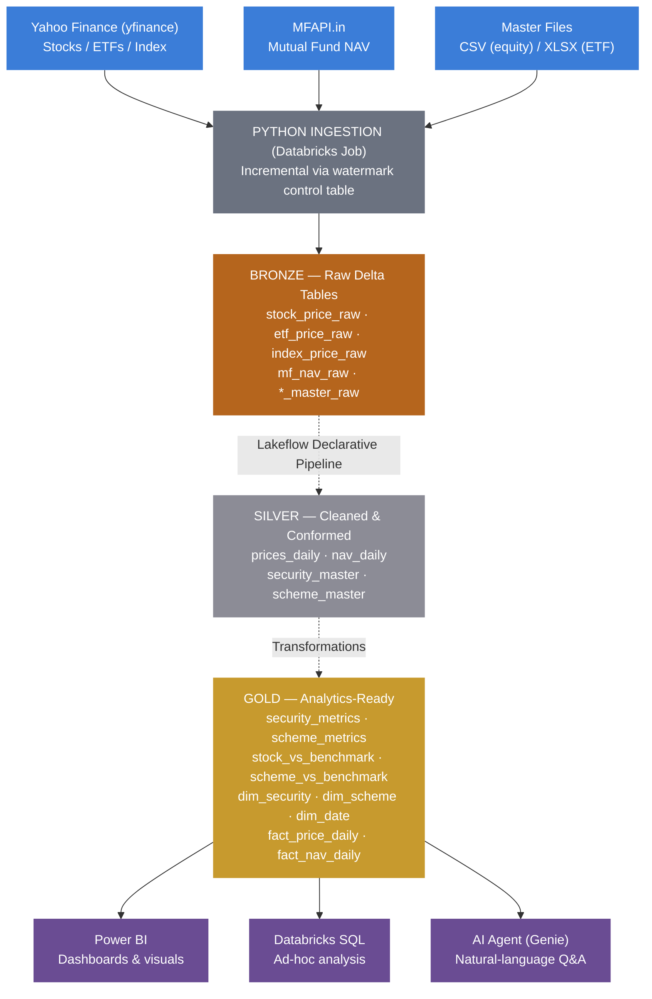

```mermaid
flowchart TD
    A1["Yahoo Finance (yfinance)<br/>Stocks / ETFs / Index"]:::source
    A2["MFAPI.in<br/>Mutual Fund NAV"]:::source
    A3["Master Files<br/>CSV (equity) / XLSX (ETF)"]:::source

    A1 --> B
    A2 --> B
    A3 --> B

    B["PYTHON INGESTION (Databricks Job)<br/>Incremental via watermark control table"]:::ingest

    B --> C

    C["BRONZE — Raw Delta Tables<br/>stock_price_raw · etf_price_raw · index_price_raw<br/>mf_nav_raw · *_master_raw"]:::bronze

    C -.Lakeflow Declarative Pipeline.-> D

    D["SILVER — Cleaned & Conformed<br/>prices_daily · nav_daily<br/>security_master · scheme_master"]:::silver

    D -.Transformations.-> E

    E["GOLD — Analytics-Ready<br/>security_metrics · scheme_metrics<br/>stock_vs_benchmark · scheme_vs_benchmark<br/>dim_security · dim_scheme · dim_date<br/>fact_price_daily · fact_nav_daily"]:::gold

    E --> F1["Power BI<br/>Dashboards & visuals"]:::serve
    E --> F2["Databricks SQL<br/>Ad-hoc analysis"]:::serve
    E --> F3["AI Agent (Genie)<br/>Natural-language Q&A"]:::serve

    classDef source fill:#3B7DD8,color:#fff,stroke:none
    classDef ingest fill:#6B7280,color:#fff,stroke:none
    classDef bronze fill:#B5651D,color:#fff,stroke:none
    classDef silver fill:#8C8C96,color:#fff,stroke:none
    classDef gold fill:#C79A2E,color:#fff,stroke:none
    classDef serve fill:#6A4C93,color:#fff,stroke:none
```
